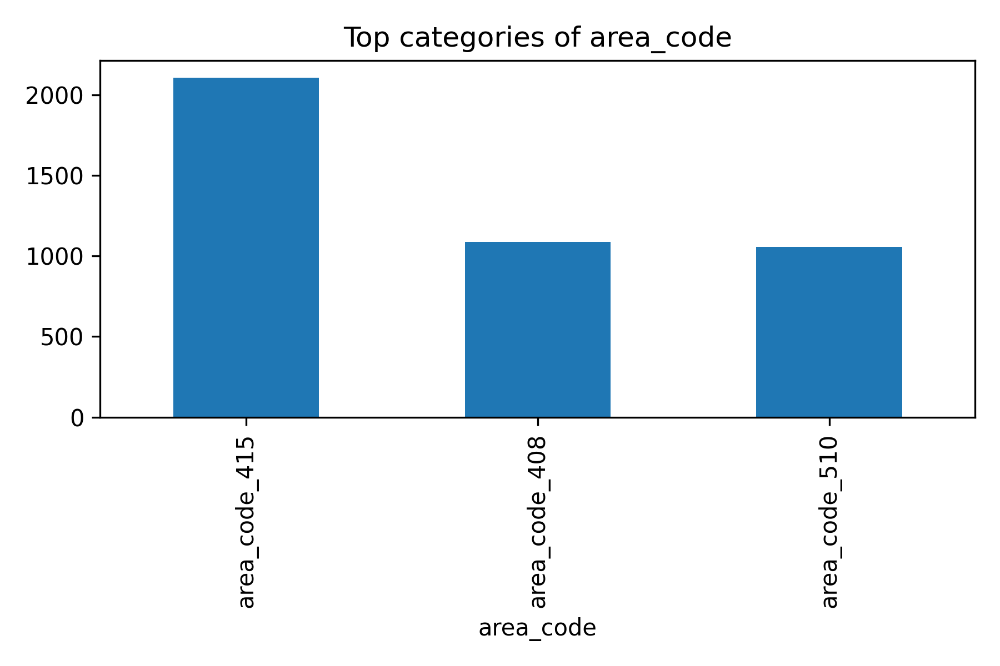

# 📊 Exploratory Data Analysis (EDA) Findings with Visuals

This document presents the exploratory data analysis (EDA) of the churn dataset with **plots and key insights**. Each feature has both a textual summary and a linked visualization.

---

## 🎯 Target Variable: Churn

- The dataset is **imbalanced**, with a much larger proportion of non-churners than churners.
- Churn rate is approximately **14%**.

---

## 📌 Categorical Features

### 1. **International Plan**
- Majority of customers **do not** have an international plan.
- Customers with international plans churn more frequently.

### 2. **Area Code**
- Three distinct area codes: 408, 415, and 510.
- Area code 415 dominates the dataset.
- Distribution appears fairly balanced across churn.

### 3. **State**
- Customers are spread across multiple states.
- Top states by count: **WV, MN, ID, AL, VA**.
- State distribution is relatively uniform with some high-churn regions.

---

## 📌 Numerical Features

### 4. **Account Length**
- Distribution is approximately **normal** centered around ~100 days.
- No strong relation to churn observed.

### 5. **Number of Voicemail Messages**
- Highly skewed: majority have **0 messages**.
- Some customers have up to ~50 messages.
- Stronger retention among voicemail users.

### 6. **Day Minutes / Calls / Charge**
- Strongly correlated (minutes ↔ charge).
- Normally distributed around ~180 minutes and ~30 charge.
- Calls are centered around ~100.

### 7. **Evening Minutes / Calls / Charge**
- Evening minutes and charges are highly correlated.
- Distributions are normal-like, centered around ~200 minutes and ~18 charge.
- Evening calls average ~100.

### 8. **Night Minutes / Calls**
- Normally distributed with peaks around 200 minutes and 100 calls.
- Similar shape to day/evening features.

---

## 🔑 Final Selected Features

1. **Categorical**
   - state
   - area_code
   - international_plan
   - voice_mail_plan

2. **Numerical**
   - account_length
   - number_vmail_messages
   - total_day_minutes, total_day_calls, total_day_charge
   - total_eve_minutes, total_eve_calls, total_eve_charge
   - total_night_minutes, total_night_calls
   - customer_service_calls

---

## ✅ Summary

- **Voicemail Plan** and **International Plan** are strong churn predictors.
- **Customer Service Calls** show high predictive power (more calls → more churn).
- **Usage Features (minutes, charges, calls)** follow normal distributions and should be standardized before modeling.
- Categorical features like **state** and **area_code** may introduce regional effects.

This dataset is **well-prepared for machine learning**, with mostly clean distributions and interpretable features.
